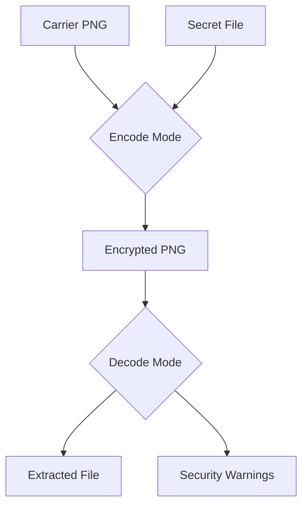

# CypherVault - Advanced Steganography Toolkit


CypherVault is a professional-grade steganography toolkit designed for security researchers, penetration testers, and digital forensics specialists. Developed by S.Kumar, this advanced tool enables secure data hiding within PNG images with specialized capabilities for handling executable payloads while maintaining strict ethical safeguards.

## Key Features

🔐 **Advanced Steganography Engine**
- LSB (Least Significant Bit) embedding technique
- Support for text and binary files
- Automatic PNG conversion for lossless operations
- Data integrity verification
- Payload encryption via Base64 encoding

⚠️ **Malware Handling Protocol**
- Executable file embedding (.exe, .bat, .dll, etc.)
- Multi-level security warnings
- SHA-256 hash verification
- User confirmation prompts
- Ethical use disclaimers

🖥️ **Professional Interface**
- Hacker-themed terminal interface
- Typewriter effect outputs
- Color-coded status messages
- Security status indicators
- Progress simulation animations

⚙️ **Demo System**
- Safe malware simulation
- Automatic carrier image generation
- Full embedding/extraction workflow
- Interactive execution prompt

## Installation

```bash
# Clone repository
git clone https://github.com/securewithsk/CypherVault.git
cd CypherVault

# Install dependencies
pip install pillow

# Run the tool
python cyphervault.py --help
```

## Usage

### Basic Operations

```bash
# Encode text message
python cyphervault.py --encode --image input.png --text "Secret Message" --output hidden.png

# Decode message
python cyphervault.py --decode --image hidden.png

# Encode file
python cyphervault.py --encode --image input.png --file document.pdf --output secret.png
```

### Malware Handling

```bash
# Encode executable with security warnings
python cyphervault.py --encode --image carrier.png --file payload.bat --output malware.png

# Decode and extract executable
python cyphervault.py --decode --image malware.png
```

### Demonstration Mode

```bash
# Run full malware simulation demo
python cyphervault.py --demo
```

The demonstration will:
1. Create a harmless sample batch file
2. Generate a carrier image
3. Embed the batch file into the image
4. Extract the payload
5. Prompt for safe execution

## Security Protocols

CypherVault implements multiple security measures:

1. **Ethical Safeguards**
   - Malware embedding requires explicit confirmation
   - Clear warnings for executable files
   - Developer disclaimer of liability

2. **Technical Protections**
   - SHA-256 verification of embedded files
   - File type validation and extension checking
   - Base64 encoding layer
   - Automatic payload analysis

3. **Operational Security**
   - Never auto-execute extracted files
   - Security alerts during extraction
   - Clear risk notifications
   - Safe demo mode with simulated payloads

## Developer Information

**Developer:** S.Kumar  
**Ownership:** S.Kumar  
**Portfolio:** [srimant.srintech.in](https://srimant.srintech.in)  
**Instagram:** [@secure.with.sk](https://instagram.com/secure.with.sk)  

## Ethical Considerations

> **WARNING:** CypherVault is designed for legitimate security research and authorized penetration testing only. Malicious use is strictly prohibited. The developer assumes no liability for misuse of this software. Always obtain proper authorization before testing systems and comply with all applicable laws.

## Technical Specifications

- **Language:** Python 3
- **Dependencies:** Pillow
- **Supported Formats:** PNG (input/output), any file type for embedding
- **Payload Capacity:** Image width × height × 3 bits
- **Security Rating:** Professional/Research

## Sample Workflow



## Contribution

Contributions are welcome! Please read our [contribution guidelines](CONTRIBUTING.md) before submitting pull requests.

## License

This project is licensed under the **Ethical Security Research License (ESRL) 1.0** - see [LICENSE](LICENSE) file for details.

---

**Disclaimer:** This tool is for educational and authorized security research only. The developer disclaims all responsibility for unauthorized or malicious use.
